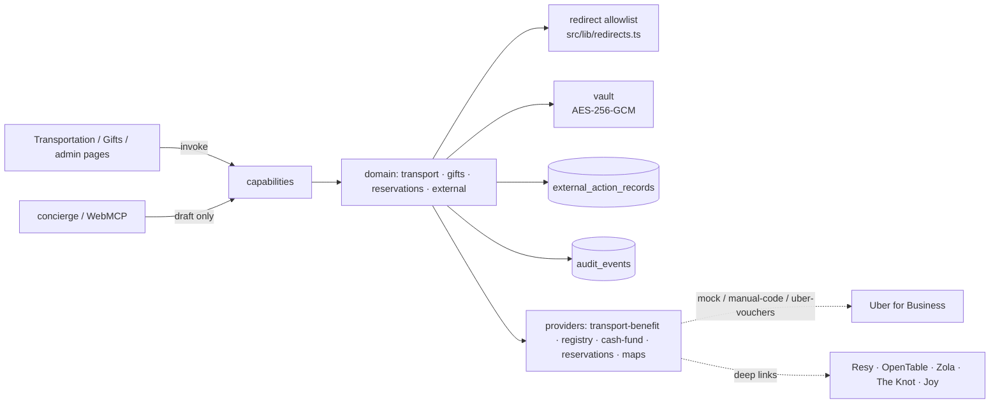

# External actions: ride benefits, gifts, reservations (level 09)

Everything a guest can *do* outside the site — take a ride, buy a gift, reserve a table —
is delegated to a specialist provider (ADR-0004). The site owns the story, the
personalisation, the audit trail, and an explicit, labelled handoff; it is never merchant of
record, never fabricates success, and never treats a click on a link as "done".

## Directories

| Layer | Path | Contents |
|---|---|---|
| Schema | `src/db/schema/{transport,gifts,reservations,external}.ts`, migration `0002_transport_gifts_reservations_external` | `transportation_entitlements`, `transportation_claims` (unique per entitlement), `transportation_manual_codes` (sealed), `gift_links`, `reservation_venues`, `external_action_records` |
| Domain | `src/domain/transport` | repo, eligibility fact-source seam, DB manual-code source, static guidance with provenance, the claim transaction |
| | `src/domain/gifts` | brief-fixed copy, repo, ladder (admin rows → env links → placeholders) |
| | `src/domain/reservations` | repo + built-in placeholders, ladder resolution, confirmation card shape |
| | `src/domain/external` | vault, guest handoff (allowlist), external action records + audit, dev principals (e2e only) |
| Providers | `src/providers/transport-benefit` | mock, manual-code (installable `ManualCodeSource` seam), **Uber Vouchers adapter** (`uber.ts`) |
| Capabilities | `src/capabilities/*` listed below, aggregated in `transport_gifts_reservations.ts` | one registration line in `src/capabilities/index.ts` |
| UI | `src/components/handoff/**`, `src/app/(guest)/transportation`, `src/app/(public)/gifts`, `src/app/(admin)/admin/{transport,gifts,reservations}` | handoff / confirmation / unavailable cards, claim flow, page-recipe seam, admin forms |

## Capabilities

| Name | Kind | Auth | Requires | Step-up | Confirmation | Idempotent | Exposure |
|---|---|---|---|---|---|---|---|
| `get_my_transportation_options` | read | anonymous (personal part only for the signed-in guest) | – | – | – | – | ui · ai · webmcp |
| `draft_my_transportation_claim` | draft | guest | `claim_transportation_benefit` | – | issues the token (bound to `{entitlementId}`) | – | ui · ai · webmcp |
| `claim_my_transportation_benefit` | transaction | guest | `claim_transportation_benefit` | **yes** | **explicit** (ui-only redemption) | **yes** | ui · ai · webmcp (models get `confirmation_required {requires_ui}`) |
| `list_gift_links` | read | anonymous | – | – | – | – | ui · ai · webmcp |
| `open_gift_link` | external | anonymous | – | – | inline | no (anonymous cannot hold keys; the record is a log, not a commitment) | ui · ai · webmcp |
| `get_reservation_options` | read | anonymous | – | – | – | – | ui · ai · webmcp |
| `prepare_reservation` | draft | guest | – | – | issues a token only when an API rung can commit (none yet) | – | ui · ai · webmcp |
| `open_reservation_link` | external | anonymous | – | – | inline | no | ui · ai · webmcp |
| `admin_assign_transportation_entitlement` | action | admin | `admin_guest_ops` | – | inline | yes | ui |
| `admin_revoke_transportation_entitlement` | action | admin | `admin_guest_ops` | – | inline | yes | ui |
| `admin_upload_transportation_codes` | action | admin | `admin_integrations` | – | inline | yes | ui |
| `admin_list_transportation_entitlements` | read | admin | `admin_guest_ops` | – | – | – | ui |
| `admin_upsert_gift_link` | action | admin | `admin_content` | – | inline | yes | ui |
| `admin_list_gift_links` | read | admin | `admin_content` | – | – | – | ui |
| `admin_upsert_reservation_venue` | action | admin | `admin_content` | – | inline | yes | ui |
| `admin_list_reservation_venues` | read | admin | `admin_content` | – | – | – | ui |
| `admin_list_external_actions` | read | admin | `admin_audit` | – | – | – | ui |

## Ride benefits

1. **Entitlement** (`transportation_entitlements`): one row per guest per programme,
   assigned by an admin with amount / validity / area as *text* (the Uber programme terms are
   backlog P-05 and are never invented). `guestIsMinor` is the conservative eligibility fact
   until the identity swarm supplies real ones.
2. **Eligibility seam** (`src/domain/transport/eligibility.ts`): `TransportEligibilityFactSource`
   with a default of "adults eligible, minors never". At integration Swarm D registers its
   source (`registerEntitlementFactSource`, `src/domain/identity`) through
   `setTransportEligibilityFactSource`; nothing else changes.
3. **Claim** (`claim_my_transportation_benefit`): a `transaction` — fresh session, explicit
   confirmation issued by `draft_my_transportation_claim` and redeemable only on the `ui`
   surface, idempotency key required. The handler re-checks ownership (**the individual
   guest**, never a household manager: `entitlement.guestId === principal.guestId`),
   eligibility, and the validity window; reserves the one claim slot (`INSERT … ON CONFLICT DO
   NOTHING` on the unique `entitlement_id` index); calls the provider with our claim id as the
   idempotency anchor; seals the redemption link or code; audits `transport.claimed` and
   writes an `external_action_records` row (`transport_claim`, `committed`). A double claim
   with the same key replays; with a different key it returns the first claim; the database
   refuses a second row regardless.
4. **Secrets**: unclaimed codes and issued links are sealed with AES-256-GCM
   (`src/domain/external/vault.ts`; key from `TRANSPORT_SECRETS_KEY`, else derived from
   `CONFIRMATION_SECRET`). They are never logged (pino redacts `code`/`voucher`/`token`),
   never in audit metadata (`redactForAudit` + we only store ids/kinds), never in the
   idempotency table (the transaction output carries `redemptionKind` only), and only ever
   returned by `get_my_transportation_options` **to the owner on the `ui` surface**; the
   concierge and WebMCP get `{ kind: 'hidden', revealRoute: '/transportation' }`.
5. **Providers** (`TRANSPORT_BENEFIT_MODE`): `mock` (default; uber.com-shaped fake links,
   labelled "Test mode" in the UI), `manual-code` (admin-uploaded codes from
   `transportation_manual_codes`, handed out atomically with `FOR UPDATE SKIP LOCKED`, idempotent
   per claim), `uber` (Uber for Business Vouchers: client-credentials token, get-or-create a
   voucher whose external reference is our claim id, redemption link validated against the
   allowlist; degrades to the mock when credentials are missing and names them in
   `validateConfig`). "Open in Uber" is a handoff into the Uber app; the site never redeems on
   the guest's behalf and never sees a rider account.
6. **Non-transactional guidance** lives in `src/domain/transport/content.ts` with provenance
   (brief §2, chicagoathletichotel.com): airports, "do I need a car", valet entrance at 71 E
   Madison, transit and accessibility directions on the hotel FAQ, getting home. Unknowns are
   `TODO(Tyler & Sara)` paragraphs rendered as marked placeholders.

## Gifts

`gift_links` (admin) → `REGISTRY_LINKS_JSON` / `CASH_FUND_LINKS_JSON` (env) → built-in
`TODO(Tyler & Sara)` placeholders, per kind. Copy is fixed by the brief
(`src/domain/gifts/copy.ts`): "Help us with our next adventures", presence first, never
"cash fund" / "donate", no amounts — tests assert it. Every link is validated against the
redirect allowlist when written **and** when read (a tampered row is dropped). The gifts page
renders one `ExternalHandoffCard` per link naming the provider; there is no iframe, no form,
no purchase state (no provider API is integrated; ADR-0004 §5 "check with the provider").

## Reservations

`ReservationCapability` ladder per place (ADR-0004 §3): `api` → `deep-link` (Resy /
OpenTable with date and party size) → `url` (admin-configured page) → `unavailable` (message
+ `/ask-us`). `get_reservation_options` runs it for one or all places; `prepare_reservation`
builds the review card (date / time / party / name) and records `reservation_prepare` (never
the contact name); `open_reservation_link` records `reservation_link` and returns the
handoff, or the honest unavailable rung with no `handoffUrl`. No reservation API is
contracted, so `canCommit` is always false and no commit transaction exists; when one is
added it takes the token `prepare_reservation` will issue and is a `transaction` with step-up.
Built-in places until admins configure real ones: Cindy's (official site link; reservation
link is P-07) and an explicit placeholder that exercises the unavailable rung. `placeRef`
links to the content swarm's `places` at integration.

## External action records

`src/domain/external/records.ts` writes one `external_action_records` row **and** one audit
event (`external_action.initiated|confirmed|failed`) for every handoff, preparation, claim or
failure: kind, provider, status, actor ref, target, surface, request id, and only the target
**host** of the URL (deep links carry dates and party sizes; redemption links are secrets).
`admin_list_external_actions` exposes the log to `admin_audit`.

## Redirect allowlist

Every URL a guest can obtain passes `assertAllowedRedirect` (`src/lib/redirects.ts`) through
`toGuestHandoff` (`src/domain/external/handoff.ts`): https only, no credentials, allowlisted
partner hosts (maps hosts pinned). Provider output (Uber's redemption link, Resy/OpenTable
builders), admin rows, environment JSON and the built-in placeholders all go through the same
gate at read time. Tests: `tests/unit/transport-domain.test.ts`, `tests/unit/redirects.test.ts`
(foundation), `tests/integration/gifts-reservations.test.ts`, `tests/security/redirect.spec.ts`.

## Testing seams

- `DEV_TEST_PRINCIPALS=1` (never in production) installs a cookie-driven principal resolver
  (`wedding-dev-principal=guest:<guestId>:<householdId>[:stale][:noclaim]` or `admin:<id>`)
  so Playwright can drive claims and admin pages before the identity swarm lands; a real
  `setPrincipalResolver` always replaces it.
- `setProviderOverride('transport-benefit', …)` and `setTransportEligibilityFactSource(…)`
  for tests; `MockTransportBenefit.reset()` clears mock vouchers.

## Authorization table

| Route / action | Capability | Entitlement / ownership | Test |
|---|---|---|---|
| `/transportation` (benefit section) | `get_my_transportation_options` | guest; benefits filtered by `principal.guestId`; secrets ui-only | `transport-claims.test.ts` "shows the benefit… only to its owner", ai/webmcp hidden |
| Review and claim | `draft_my_transportation_claim` | `claim_transportation_benefit`; own entitlement else `not_found` | same file; `voucher.spec.ts` |
| Confirm and claim | `claim_my_transportation_benefit` | `claim_transportation_benefit` + step-up + ui confirmation + key; handler: owner, eligible, window, one claim | double-claim, cross-household, manager, minor, stale, anonymous, ai surface, unique index |
| `/gifts` | `list_gift_links` / `open_gift_link` | anonymous; allowlist at read | `gifts-reservations.test.ts`, `redirect.spec.ts` |
| Reservation cards | `get_reservation_options` / `open_reservation_link` / `prepare_reservation` | anonymous / anonymous / guest | ladder rungs, unavailable, tampered row, contact name absent |
| `/admin/transport` | `admin_list_*`, `admin_assign_*`, `admin_revoke_*`, `admin_upload_*` | `admin_guest_ops` / `admin_integrations` | guest → forbidden; upload counts only |
| `/admin/gifts`, `/admin/reservations` | `admin_upsert_*`, `admin_list_*` | `admin_content`; allowlist at write | EVIL URL matrix → `validation`; guest → forbidden |
| External action log | `admin_list_external_actions` | `admin_audit` | admin without `admin_audit` → forbidden |
