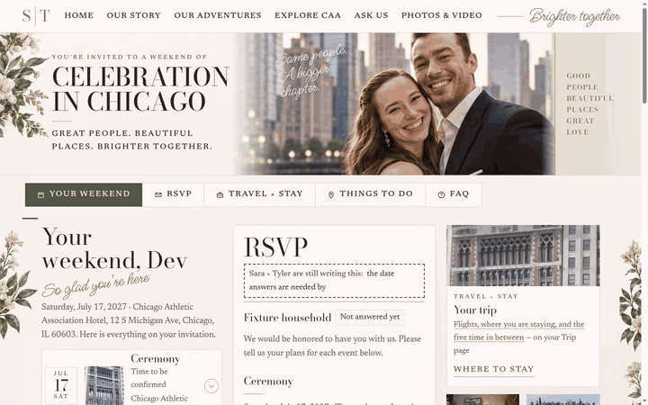
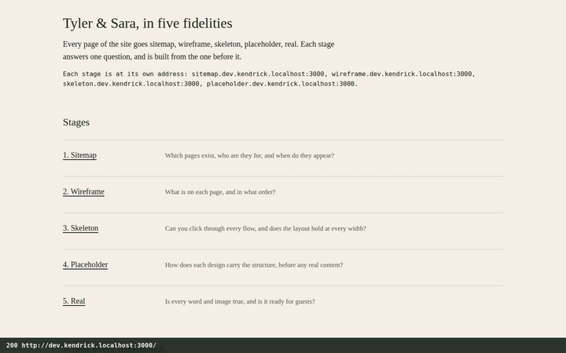
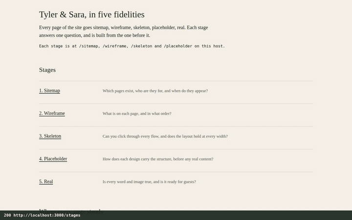

# Demos

Short recordings of the site as it is on this branch: the approved Botanical–Deco design, the
default for every guest. The GIFs play inline on GitHub; each links to the sharper MP4.

They are recorded, not mocked up: [webreel](https://github.com/vercel-labs/webreel) plays scripted
tours against a production build, and
[agent-browser](https://github.com/vercel-labs/agent-browser) drives the signed-in guest journey on
the test server. [How they are made, and how to re-record them](../ops/demos.md).

The portraits are generated stand-ins that Sara and Tyler approved, not photographs of the wedding
(the site's own `/credits` page says so, from `src/domain/media/credits.ts`; see also
[asset licensing](../ops/asset-licensing.md)). The household in the guest demo is the seeded test
fixture: "Dev Fixture" and "Eve Fixture" are not real guests, and the menu is the fixture menu.
Dashed boxes are the site's own placeholders for facts only the couple can supply.

## Home

The first screen, the welcome strip, the band with the day's schedule and the countdown, the
footer, then the nav on to Our Story.

## Our Story

The chapter reader: each chapter opens in place from its tab, the tabs answer the arrow keys (the
keystrokes are drawn on screen), and the reader steps from one chapter to the next. Then the places
that shaped the story.

## Explore CAA + Chicago

The venue, then the city guide: pointing at a place lights its pin on the map, and choosing a pin
picks its place. Then the ribbon, the building's history and the list of things to look for.

## Your Weekend and the RSVP

Signed in as a household, the RSVP sits on the same page as the weekend's plan. One tap per person
per event; the meal question and the guest's name appear only once someone is coming; needs are
kept for the caterer and the planner; nothing is saved until the answers are reviewed; the
confirmation says them back in plain words.

## On a phone

The same home page at 390px, the width the site is designed from, with the bar of three
destinations that stays at the bottom of the screen.

## The design pipeline, by subdomain

Proof that the wedding app serves every stage of the design pipeline
([stages/README.md](../../stages/README.md)) at its own address. The strip along the bottom is
written by the browser, not the tour: the HTTP status it got and the address it is on. It is the
recorder's (`demos/recorder-preload.cjs`), never the site's. `kendrick.localhost` is production's
shape, kendrick.wedding, on the recording machine.

The hub at `dev.kendrick.localhost`, listing every stage's address; stage 1 at
`sitemap.dev.kendrick.localhost`; the RSVP page there, then the same page at
`wireframe.dev…`, `skeleton.dev…` (clicked through into "Who is coming"), `placeholder.dev…` (the
theme picker switched to Gilded Hour), and finally the real site at `kendrick.localhost`, each hop
by the stage bar's own link. Then `dev.kendrick.localhost/rsvp`, a 404: the hub host is the hub
alone, never the wedding app under a second name. Last, the board: every page at every stage, with
its sign-offs.

## The design pipeline, by path (every pull request's preview)

The same stages on one host, as every preview carries them: `/stages` is the hub, then
`/skeleton`, `/skeleton/rsvp`, `/wireframe/rsvp` and `/placeholder/rsvp` by the stage bar, and
`/rsvp`, the real site, on the same host. Last, `/_stages/_hub/index.html`, a 404: the assembled
files are never served directly, so kendrick.wedding itself never shows them. (One frame on the
way into `/skeleton` shows the page tiled: that is the recorder catching the compositor
mid-navigation, not the page.)

